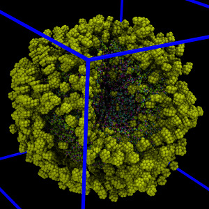

cellpack2moltemplate
===========

##  Typical Usage

    cellpack2lt.py -in HIV-1_0.1.cpr -out system.lt      # -- or --
    cellpack2lt.py  <  HIV-1_0.1.cpr  >   system.lt

where "HIV-1_0.1.cpr" is a JSON file in CellPACK output format,
  and "HIV-1_0.1.lt" is the corresponding file converted to moltemplate format

##  Description



cellpack2lt.py converts json formatted files created by CellPACK into
moltemplate format.
These files can be read by moltemplate and converted into files which the
LAMMPS simulation program can read sing the following command:

    moltemplate -nocheck system.lt

Then you can run a LAMMPS simulation using:

    lmp_mpi -i run.in

The "run.in" file contains several LAMMPS commands which control
how the simulations will be carried out
(including "rigid" constraints, Verlet timestep size,
 temperature, langevin damping parameters, and simulation duration)
There is an example "run.in" file in the "doc" subdirectory.

If VMD is installed, you can run moltemplate.sh with the additional
"-vmd" argument to view the structure using VMD immediately.
An optional file, "vmd_commands.tcl", is also created
so that the radii of the particles are displayed correctly in VMD.
(To get this to work, you will have to load the "vmd_commands.tcl" file from 
 within VMD by selecting the "Extensions"->"Tk Console", and "File"->"Load File"
 menu options.  Controlling other visual features such as color is
 planned for the future.)


## Optional Arguments

```
   -in FILE_NAME     # Specify the name of the input file (as opposed to "<")
   -url URL          # Read the CellPACK JSON text from URL instead of a file
   -out FILE_NAME    # Specify the output file (as opposed to ">")
   -pairstyle STYLE  # Select force formula (eg. -pairstyle lj/cut/coul/debye)
                     #               (by default -pairstyle lj/cut)
   -debye            # Specify the Debye length (if applicable)
   -epsilon          # Specify the "Epsilon" Lennard-Jones coeff (default: 1)
   -deltaR           # Specify the resolution of particle radii (default 0.1)
   -name OBJECTNAME  # Create a moltemplate object which contains everything.
                     # (useful if you want multiple copies of the system later)
```


##  Forces between particles

As of 2017-10-23, the force field it uses is quite stupid.
(I'm using purely repulsive Lennard-Jones spheres.)
Not surprisingly, because there are no attractive forces or charges,
the proteins in the system drift apart.
(More accurately the components typically fly apart at high speed due
to occasional modest overlap between nearby particles arranged by CellPACK.
Protocols to relax the energy of the system beforehand will have to be
developed because the "minimize" commands available in LAMMPS do not currently
work with the rigid-body motion integrator we are using.)

In the future, it we will have to decide upon the kinds of forces and
constraints we want to use, as well as make it possible for users
to convey at least some of this information in CellPACK, and somehow convey
this information to moltemplate inside the JSON files created by CellPACK.


##  Python interface

This program be imported as a module and run using "ConvertCellPACK()".
However the list of arguments to this function has not been decided,
and is likely to change radically in the future.  Currently it is:

```python
def ConvertCellPACK(file_in,        # this is typically sys.stdin
                    filename_in,    # optional input file name
                    file_out,       # this is typically sys.stdout
                    filename_out,   # optional output file name
                    out_obj_name,   # optional moltemplate object name
                    delta_r,        # radial resolution
                    pairstyle,      # which LAMMPS pair_style do you want?
                    pairstyle2docs, # documentation for these pair styles
                    pairstyle2args, # required arguments for these pair_styles
                    epsilon,        # Lennard-Jones parameter
                    debye)          # Debyle length (if applicable)
```

## Usage Example:

```python
import cellpack2lt
fin = open('HIV-1_0.1.cpr', 'r')
fout = open('system.lt', 'w')
ConvertCellPACK(fin,
                'HIV-1_0.1.cpr',
		fout,
		'system.lt',
		''
                0.1
                'lj/cut',
                {'lj/cut':'http/lpairstyle2docs},
		{'lj/cut':'25.0'},
                0.5961621,     # = k_B*temperature at 300K in kcal/mole
		1.0)
```

## Requirements

cellpack2moltemplate depends on numpy

## License

cellpack2moltemplate is available under the terms of the open-source 3-clause
BSD license.  (See `LICENSE.md`.)

